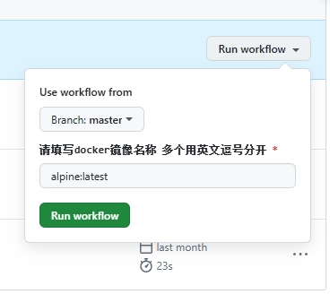
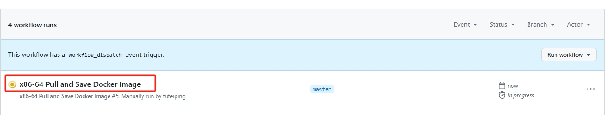
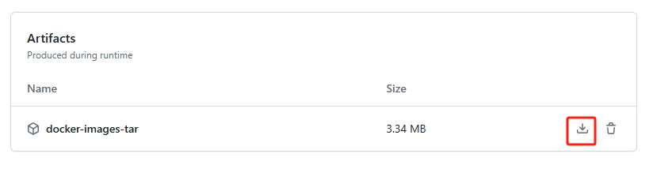

[](https://github.com/tufeiping/DockerTarBuilder/blob/master/LICENSE)


## ❓ 这是什么？
它是一个工作流。可以快速拉取并指定架构/平台的 `docker` 镜像并在 `Github` 提供的环境中完成缓存和压缩，最后提供 `zip` 的压缩文档，以便下载使用。

## 📖 使用说明
到 [https://docker.fxxk.dedyn.io/](https://docker.fxxk.dedyn.io/) 或 [https://hub.docker.com](https://hub.docker.com) 找到所需镜像。

### 选择架构
记录好镜像名称，然后打开 [https://github.com/tufeiping/DockerTarBuilder/actions](https://github.com/tufeiping/DockerTarBuilder/actions) 页面，选择对应的镜像类型

- ARM32 Pull and Save Docker Image  支持 `ARM 32` 架构的芯片
- ARM64 Pull and Save Docker Image  支持 `ARM 64` 架构的芯片
- x86-64 Pull and Save Docker Image  支持 `X86 64` 架构的芯片（Intel or AMD）

### 拉取镜像
点击右侧上方 “Run workflow”，然后输入镜像名称。
> 注意：支持一次性打包多个镜像，多个镜像名称间用英文逗号分开，中间不能有空格

点击“Run workflow” 按钮启动工作流。



构建过程可以通过看标题前面图标状态来确定状态(如果是正在构建，会有 `working` 示意)


### 下载镜像

构建完成后，可以通过点击构建流程名进入明细页面(任务都是倒序排序的，所以是第一个)，然后可以看到 `Artifacts` 部分，点击 `docker-images-tar` 文档后面的下载按钮即可进行下载。



> Github提供的构建容器环境是时效的（默认90天），本项目设置为1天，不长期保存，所以构建完毕后在1天内下载到本地即可

配置见 `arm64.yml/amd64.yml`
```yaml
- name: Upload artifact
      uses: actions/upload-artifact@v4
      with:
        name: docker-images-tar
        path: x86-64-images.tar.gz
        retention-days: 1  # 将保留天数设置为 1 天 最多可设置90天
```

## 🗜️ 解压工具
因为镜像`tar`包一般都比较大，为了网络传输效率，对 `tar` 包进行了进一步压缩。 对于下载的镜像文件（一般都比较大，即使压缩后），在不同的平台使用对应的解压工具先进行解压缩操作。

> Windows 上推荐使用 `7zip` 或新版本的 `WinRAR`<br>
> macOS 推荐使用 `MacZip` <br>
> Linux上推荐直接用 `tar` 命令

## ⏳ 加载镜像包
解压缩后的 `tar` 可以使用 `docker` 直接加载到本地，然后更改 `tag` 就可以提交到私有/专有仓库

```shell
docker load docker-img.tar
```

## 🔗 相关项目
- [https://github.com/wukongdaily/OrangePiShell](https://github.com/SuperManito/LinuxMirrors)
- [https://github.com/monlor/docker-xiaoya](https://github.com/monlor/docker-xiaoya)
